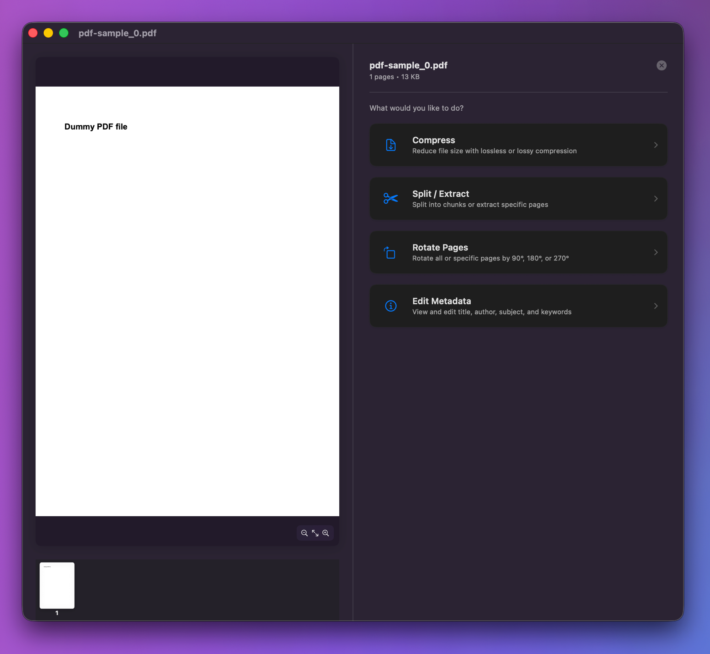
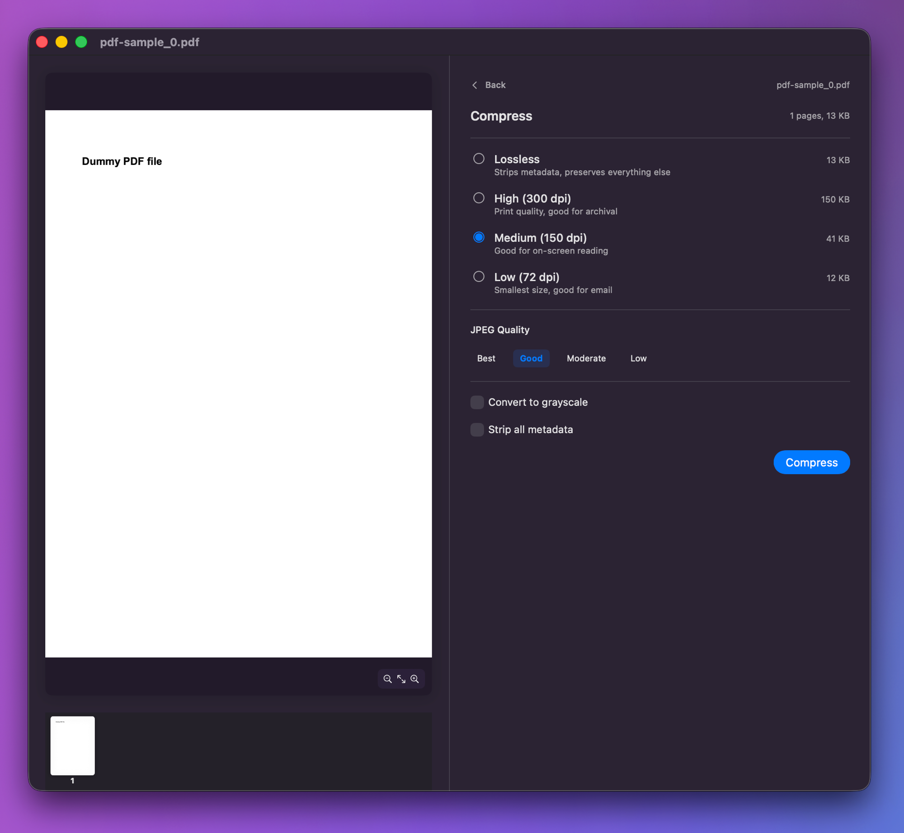
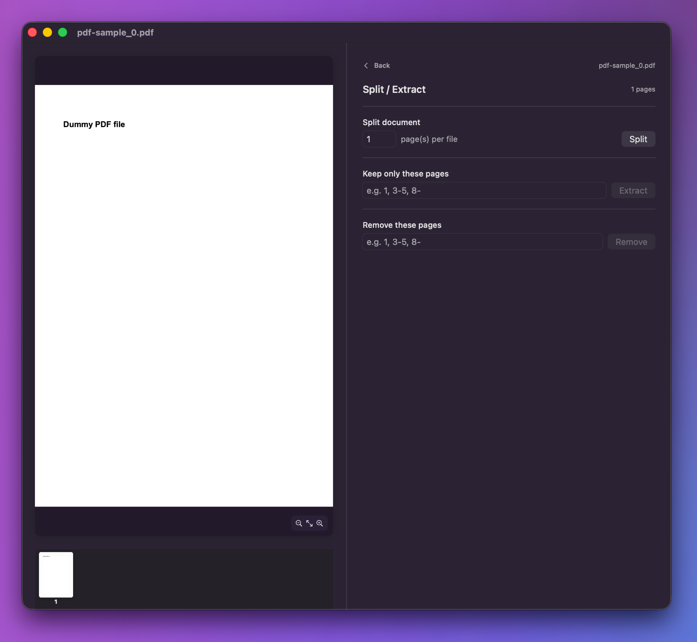
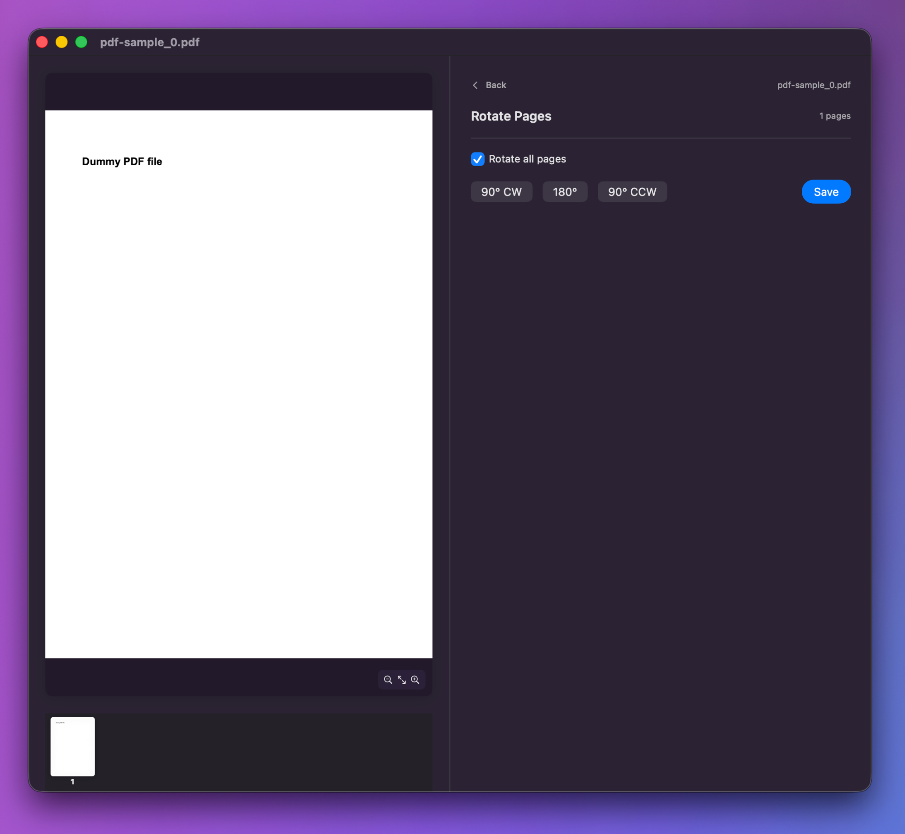
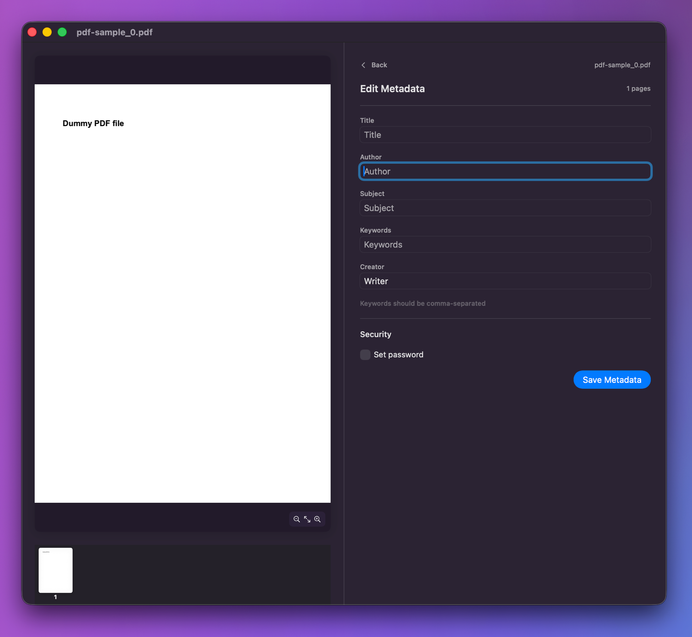

<p align="center">
  
</p>

<h1 align="center">PDFwringer</h1>

<p align="center">
  A lightweight native macOS app for compressing, merging, splitting, rotating, and editing PDF files.<br>
  Built with SwiftUI and PDFKit — no external dependencies.
</p>

<p align="center">
  
  
  
</p>

<p align="center">
  
</p>

---

## Features

### Compress

Reduce file size with lossless metadata stripping or lossy rasterization at configurable DPI (72–300) and JPEG quality. Live size estimates let you compare options before committing. Optional grayscale conversion and metadata stripping.

<p align="center">
  
</p>

### Merge

Drag-and-drop multiple PDFs, reorder them freely, sort alphabetically, and combine into a single file.

### Split / Extract

Split a document every N pages, keep only specific pages, or remove unwanted pages — all using flexible range syntax (`1, 3-5, 8-`).

<p align="center">
  
</p>

### Rotate Pages

Rotate all or selected pages by 90° CW, 180°, or 90° CCW with a live preview.

<p align="center">
  
</p>

### Edit Metadata

View and edit title, author, subject, keywords, and creator. Set or remove password protection.

<p align="center">
  
</p>

---

## Page Range Syntax

Used in Split / Extract and Rotate operations:

| Input | Meaning |
|-------|---------|
| `3` | Page 3 |
| `1,5,10` | Pages 1, 5, and 10 |
| `3-6` | Pages 3 through 6 |
| `6-3` | Pages 6 through 3 (reversed) |
| `-3` | From the start through page 3 |
| `8-` | From page 8 to the end |
| `1, 3-5, 8-` | Mixed (comma-separated) |

---

## Getting Started

### Requirements

- macOS 26.0+ (Tahoe)
- Apple Silicon (arm64)

### Build

```bash
# Command line
make app     # produces .build/PDFwringer.app
make run     # build + launch

# Or open PDFwringer.xcodeproj in Xcode (Cmd+B)
```

### Install

```bash
make app
cp -R .build/PDFwringer.app ~/Applications/
```

### Test

```bash
make test    # 110 tests across 9 suites
```

Uses [Swift Testing](https://developer.apple.com/documentation/testing). Tests cover the service/model/utility layers without requiring a running app. PDFs are generated programmatically — no fixture files.

---

## Architecture

MVVM with a stateless service layer. Navigation is a state machine driven by `AppState`.

```
PDFwringer/
├── Models/          Value types (CompressionLevel, JPEGQuality, PDFFileItem)
├── Services/        Stateless PDF ops (Compressor, Concatenator, Splitter, Rotator, MetadataEditor, PageRangeParser)
├── ViewModels/      @Observable classes (AppViewModel, CompressViewModel, ConcatenateViewModel, SplitViewModel)
├── Views/           SwiftUI views + NSViewRepresentable drop overlay
├── Utilities/       Error types, file dialogs, formatting helpers
└── Resources/       Asset catalog, AppIcon.icns
```

### Design Decisions

- **Document-first flow** — drop/select files first, then choose an action
- **NSView drop overlay** — SwiftUI's `onDrop` is unreliable in sandboxed apps; `DropReceiverView` wraps an NSView that passes clicks through via `hitTest → nil`
- **Background size estimation** — compression options probe the first page at each setting to give instant size feedback
- **Atomic writes** — all operations write to a temp file, then `FileManager.replaceItemAt` to the destination
- **Strict concurrency** — full Swift 6 `SWIFT_STRICT_CONCURRENCY = complete`, all code `@MainActor`

---

## License

[MIT](LICENSE) — Lukas N.P. Egger
