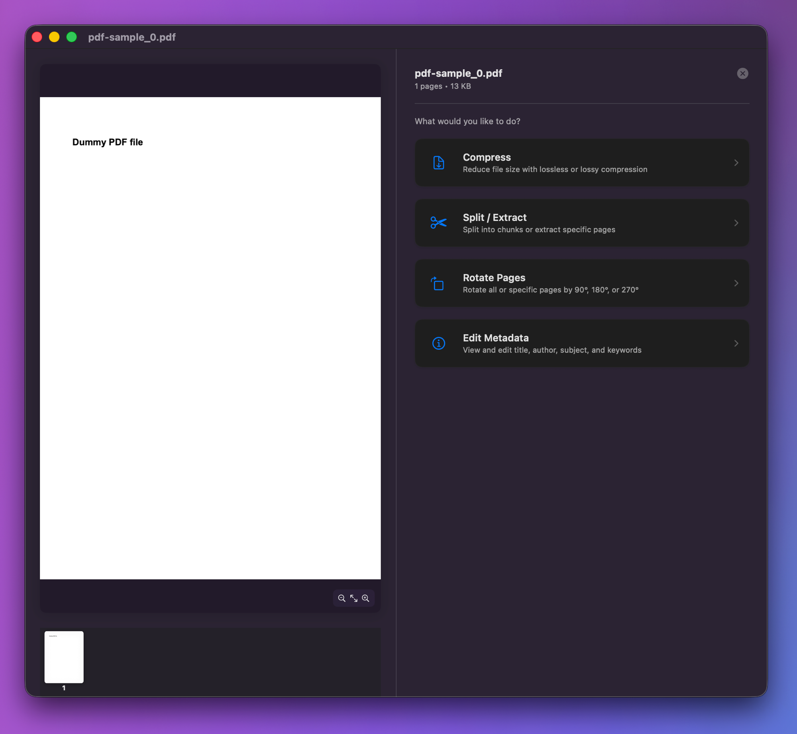
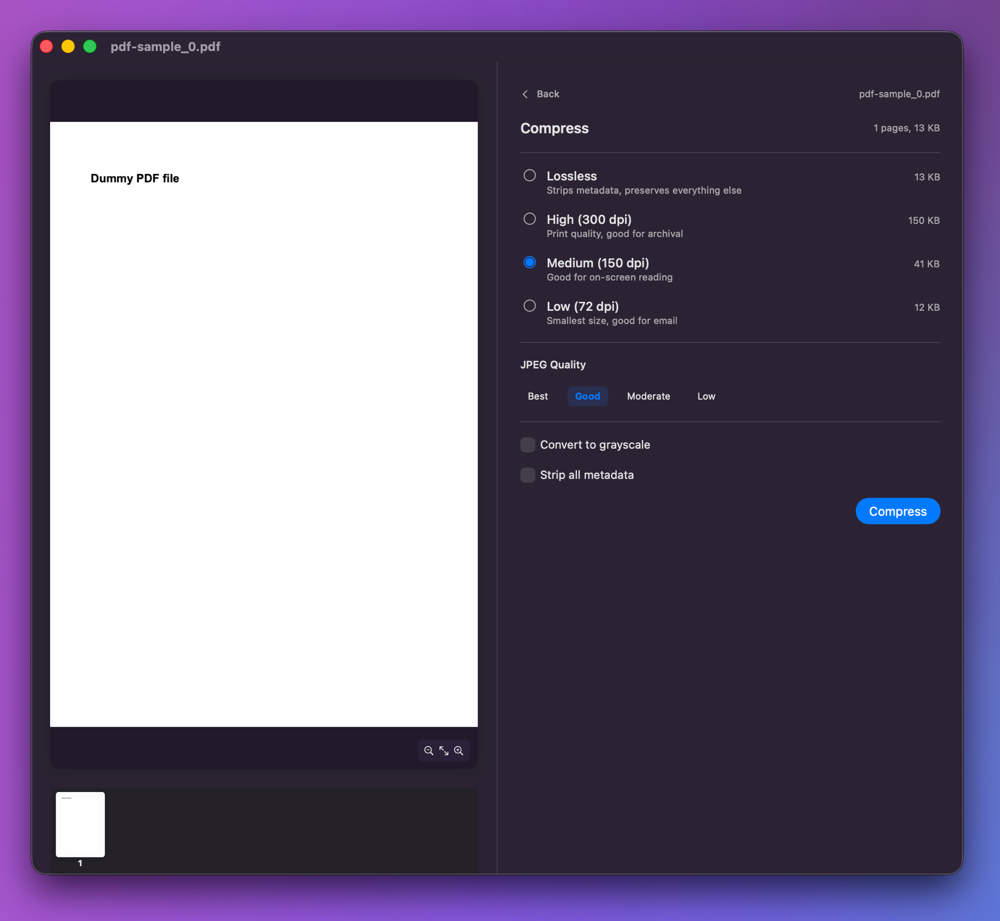
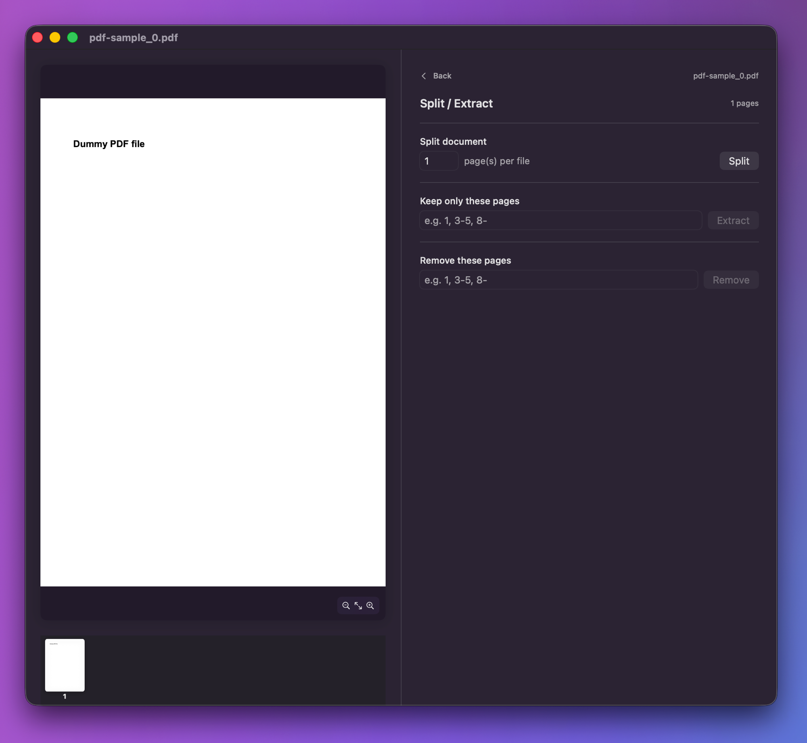
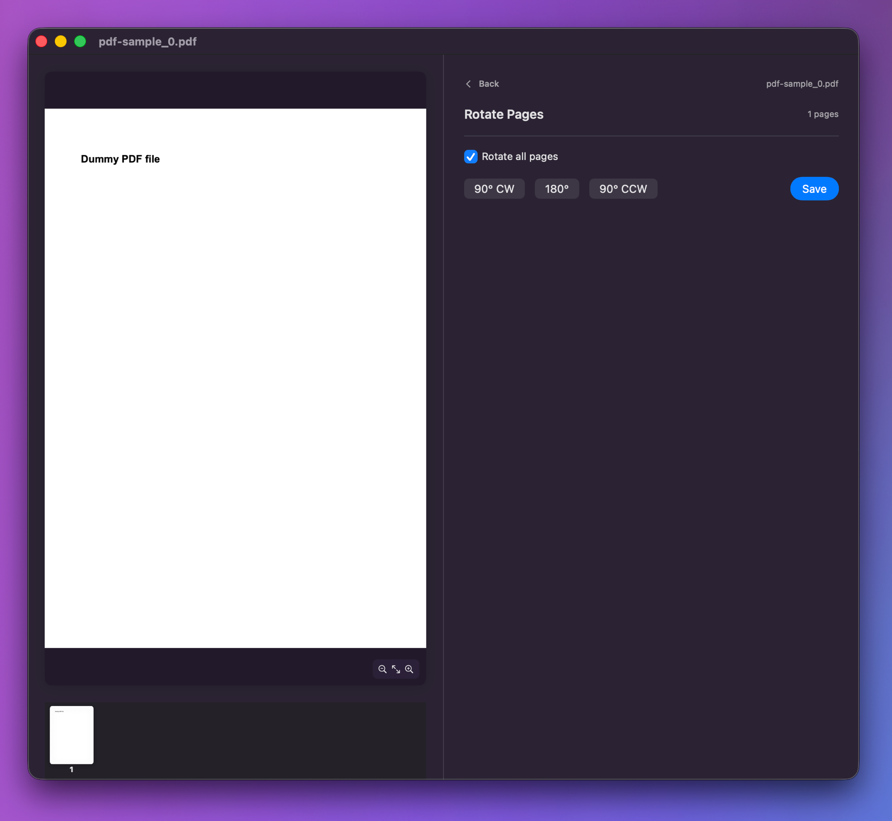
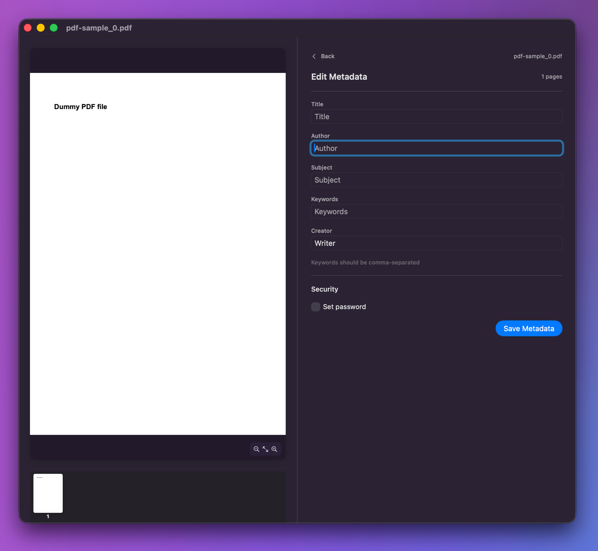

<p align="center">
  
</p>

<h1 align="center">PDFwringer</h1>

<p align="center">
  <strong>Wring every last byte out of your PDFs.</strong><br><br>
  A lightweight native macOS app for compressing, merging, splitting, rotating, cropping, color-adjusting, exporting, and editing PDF files.<br>
  Built entirely with SwiftUI and PDFKit — zero external dependencies, zero network calls, zero data collection.
</p>

<p align="center">
  
  
  
</p>

<p align="center">
  
</p>

---

## Current Status

The default branch contains the latest hardening work and compression review
flow for **Apple silicon on macOS 27.0+**. Version **0.2.1 (build 5)** refines
preview accuracy, page selection, pending/apply/save clarity, accessibility, and
visual consistency while retaining target-size compression and original/result
comparison. Release validation and
remaining App Store checks are tracked in [APP_STORE.md](APP_STORE.md). The app
has not been submitted for review or published on the App Store.

The [0.2.1 download](https://github.com/lenpr/PDFwringer/releases/tag/v0.2.1) is
signed, notarized, and available through Homebrew. All 402 tests passed; the
matching App Store candidate passed signed archive/export and Organizer validation.

See [CHANGELOG.md](CHANGELOG.md) for the public versions and earlier development
milestones. Screenshots below show the older release; current control labels
and safety guidance may differ.

---

## Why PDFwringer?

Most PDF tools are either bloated Electron apps, subscription-gated web services, or privacy nightmares that upload your documents to someone else's server. PDFwringer is different:

- **Fully offline** — your files never leave your machine
- **Native performance** — instant launches, no runtime overhead
- **Drop and done** — drag a PDF in, pick an action, save the result
- **Sandboxed** — only touches files you explicitly select

---

## Features

### Compress

Choose **Manual** compression with lossless rewriting or configurable image
resolution and JPEG quality, or **Fit under…** for an upload limit of 0.1–1,000 MB.
Target-size compression tries lossless first, then at most three image resolutions
if you explicitly allow image-based compression. Success requires the complete
output file to be strictly below the limit; estimates never decide success.

Select **Prepare…** to choose a destination and generate the result. Compare
**Original / Result** on the same page and at the same relative zoom before
selecting **Save Result**. Preparation leaves the source and existing destination
unchanged. Cancel or changing settings discards the prepared copy. Protected
lossless results retain their protection; comparison is unavailable when that
prepared copy reopens locked.

Rasterization removes searchable text, accessibility tags, interactive fields,
links, digital signatures, and existing password protection. Lossless rewriting
clears standard document-info fields; embedded XMP and private content can remain.
Oversized pages are capped to prevent bitmap inflation.

<p align="center">
  
</p>

### Merge

Combine multiple PDFs into one. Drag-and-drop files in, reorder them freely, sort alphabetically, and merge with a single click.

### Split / Extract

Pull out exactly the pages you need. Split every N pages, keep specific pages, or remove unwanted ones — all using intuitive range syntax (`1, 3-5, 8-`). Perfect for extracting chapters, removing blank pages, or breaking a monolithic PDF into manageable pieces.

<p align="center">
  
</p>

### Rotate Pages

Fix sideways scans and upside-down pages. Rotate all or selected pages by 90° CW, 180°, or 90° CCW with a live preview showing exactly what you'll get.

<p align="center">
  
</p>

### Crop / Resize

Trim excess whitespace or resize pages to standard paper sizes (A4, Letter, A5, Legal). Crop and resize are independent — trim margins without resizing, resize without cropping, or both at once. Portrait/landscape toggle included.

### Adjust Colors

Fine-tune brightness, contrast, and saturation with real-time preview. Named presets (Vivid, Muted, B&W, High Contrast) get you 90% of the way with one click — then dial in the rest manually if needed.

### Edit Metadata

View and edit title, author, subject, keywords, and creator. These are standard document-info fields; embedded XMP and other identifying content can remain. Ordinary saves retain existing password protection, or remove it when explicitly requested. Creating a new password requires explicitly flattening the document and produces verified AES-128 encryption. New passwords must contain 1–32 printable ASCII characters. Flattening turns every page into an image, including annotation and form appearances; searchable text, accessibility tags, interactive forms, links, and digital signatures are not preserved.

<p align="center">
  
</p>

### Export as Images

Export selected pages as JPEG or PNG files at configurable DPI (72/150/300). JPEG quality slider for size control. Exports to a directory with automatic filename numbering.

### Reorder Pages

Drag pages in a sidebar list to rearrange their order. Quick-actions for reversing page order or resetting to original. Saves the reordered document to a new file.

---

## Page Range Syntax

Used in Split / Extract, Rotate, and Crop operations:

| Input | Meaning |
|-------|---------|
| `3` | Page 3 |
| `1,5,10` | Pages 1, 5, and 10 |
| `3-6` | Pages 3 through 6 |
| `6-3` | Pages 6 through 3 (reversed) |
| `-3` | From the start through page 3 |
| `8-` | From page 8 to the end |
| `1, 3-5, 8-` | Mixed (comma-separated) |

---

## Getting Started

### Requirements

- macOS 27.0+
- Apple silicon Mac (Intel Macs are not supported)
- Xcode 27 with its command-line tools selected

### Build & Run

```bash
# Command line — from zero to running in seconds
make app       # produces .build/PDFwringer.app (ad-hoc codesigned)
make release   # optimized build (-O) + app bundle
make dmg       # signed + notarized drag-to-install disk image
make run       # build + launch the sandboxed app bundle
make app-store-check # credential-free Mac App Store archive validation

# Or open PDFwringer.xcodeproj in Xcode (Cmd+B)
```

### Install

Download the signed, notarized app from
[GitHub Releases](https://github.com/lenpr/PDFwringer/releases/latest), or install
it through Homebrew:

```bash
brew tap lenpr/tap
brew install --cask pdfwringer
```

For the latest source, create a local sandboxed development build:

```bash
make release
mkdir -p ~/Applications
cp -R .build/PDFwringer.app ~/Applications/
```

`make app` and `make release` are sandboxed, hardened-runtime development builds
with ad-hoc signatures. Use `make sign`, `make notarize`, or `make dmg` when the
artifact needs a trusted Developer ID signature or notarization.
Those signed-release targets require a new version and its exact release tag;
do not move an existing public tag or replace its download with different code.

### Test

```bash
make test          # compile and run every suite
make test-fast     # unit, view-model, workflow, and safety suites
make test-corpus   # slower fixture, invariant, visual, and performance suites
make verify-fixtures # validate the external corpus without running tests
```

Uses [Swift Testing](https://developer.apple.com/documentation/testing). The fast lane generates PDFs programmatically and needs no setup. `make test` and `make test-corpus` additionally require the curated 36-file external corpus; they fail before testing when files are missing or do not match the recorded checksums. The corpus is intentionally not distributed until its upstream provenance and licenses are documented. See `PDFwringerTests/Fixtures/README.md`.

---

## Distribution

### Mac App Store

The App Store build uses Xcode's archive and automatic-signing path, separately
from the Developer ID targets below:

```bash
make app-store-check
make app-store-archive APP_STORE_TEAM_ID=XXXXXXXXXX
make app-store-export APP_STORE_TEAM_ID=XXXXXXXXXX
```

The archive/export commands require committed release inputs and an exact
`appstore-v<version>-build.<build>` tag. They create local, versioned artifacts
and never upload them. See [APP_STORE.md](APP_STORE.md) for the account setup,
version/build policy, privacy and encryption decisions, validation, and upload
checklist.

### Code Signing & Notarization

The Makefile includes targets for signing and notarizing with a Developer ID certificate:

```bash
make sign       # build + sign with hardened runtime (Developer ID)
make notarize   # sign + submit the standalone app + staple its ticket
make dmg        # release + sign app and DMG + notarize/staple the DMG
```

Prerequisites:
- A "Developer ID Application" certificate installed in your keychain
- A notarytool keychain profile (set up once via `xcrun notarytool store-credentials`)
- Pass `SIGN_IDENTITY` and `NOTARY_PROFILE` on the command line or in the environment when the defaults do not match your team

Before running a signed-release target, bump `CFBundleShortVersionString` in
`PDFwringer/Info.plist`, commit the release inputs, and tag that exact commit
`v<version>`. `make sign`, `make notarize`, and `make dmg` refuse a dirty
`Makefile` or `PDFwringer/` tree and refuse a commit without the matching exact
version tag.

The app is sandboxed with `com.apple.security.files.user-selected.read-write` entitlement — no additional entitlements are needed for hardened runtime unless accessing protected resources.

### Privacy

See [PRIVACY.md](PRIVACY.md). The app makes no network requests and collects no
data. Its bundled privacy manifest also declares the required-reason APIs used
for local preferences, output-space checks, and metadata for app-owned or
user-selected files.

---

## Architecture

MVVM with a stateless service layer. Navigation is a state machine driven by `AppState`.

```
PDFwringer/
├── Models/          Value types (CompressionLevel, JPEGQuality, PDFFileItem, PaperSize)
├── Services/        Stateless PDF ops plus isolated workers and shared raster primitives
├── ViewModels/      @Observable classes (AppViewModel, CompressViewModel, ConcatenateViewModel, SplitViewModel)
├── Views/           SwiftUI views, shared components (OptionsHeaderView, PageSelectionView, PDFPreviewView, CropPreviewPanel)
├── Utilities/       Error types, atomic/exclusive file publication, dialogs, formatting helpers
└── Resources/       Asset catalog, AppIcon.icns
```

`PrivacyInfo.xcprivacy` at the target root is bundled into
`Contents/Resources` by both Xcode and Make builds.

### Design Decisions

- **Document-first flow** — drop/select files first, then choose an action
- **NSView drop overlay** — SwiftUI's `onDrop` is unreliable in sandboxed apps; `DropReceiverView` wraps an NSView that passes clicks through via `hitTest → nil`
- **Background size estimation** — compression options open the source once and batch first-page probes for every setting
- **Safe publication** — single-file outputs use atomic replacement; multi-file batches stage everything on the destination volume, publish without clobbering existing files, and roll back partial batches
- **Strict concurrency** — full Swift 6 `SWIFT_STRICT_CONCURRENCY = complete`; UI state and authoritative `PDFDocument` access stay on `MainActor`, while isolated page snapshots render and encode on detached workers

---

## License

[MIT](LICENSE) — do whatever you want with it. Lukas N.P. Egger
